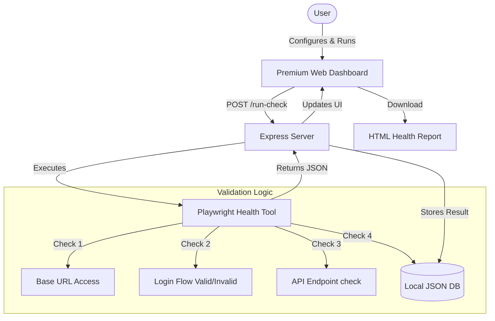

# 🏥 Environment Health Checkup

A premium, automated environment health check system designed to validate web application availability, authentication flows, and API responsiveness across multiple environments (Dev, QA, Staging, Prod).

 

## 🌟 Features

*   **Multi-Environment Support**: Seamlessly switch between Dev, QA, Alpha, Beta, and Production configurations.
*   **Premium Dark UI**: A sleek, responsive dashboard built with glassmorphism aesthetics.
*   **Automated Validation**:
    *   **URL Accessibility**: Latency tracking (Warning > 5s).
    *   **Authentication**: Verifies login success and failure paths.
    *   **Element Diagnostics**: Identifies exactly which locator (User, Pass, Button) is missing if a check fails.
*   **Persistent Configuration**: Automatically saves your environment settings to a local JSON database.
*   **Run History**: Tracks the last 50 execution results with status and performance metrics.
*   **Interactive Reports**: Generate and download professional HTML reports with environment metadata.

## 🚀 Architecture Flow



## 🛠️ Installation & Setup

1.  **Clone the Repository**
    ```bash
    git clone <repository-url>
    cd Environment-Health-Checkup
    ```

2.  **Install Dependencies**
    ```bash
    npm install
    ```

3.  **Run the Dashboard**
    ```bash
    node server.js
    ```

4.  **Access the Application**
    Open your browser and navigate to: [http://localhost:3000](http://localhost:3000)

## 📂 Project Structure

```
├── public/                 # Frontend Assets
│   ├── index.html          # Dashboard UI
│   ├── style.css           # Premium Glassmorphism Styles
│   └── app.js              # Client-side Logic (Fetch, Charts)
├── tools/
│   └── ui_health_tool.js   # Core Playwright Script
├── server.js               # Backend API & Orchestration
├── db.json                 # Local Persistence (Configs & History)
├── main.js                 # CLI Entry Point (Legacy)
└── package.json            # Dependencies
```

## 🔧 Configuration

You can configure the following parameters directly from the UI for each environment:

*   **Base URL**: The application entry point.
*   **Credentials**: Username/Password for auth checks.
*   **Locators**: CSS/XPath selectors for login fields.
*   **API Endpoint**: Backend service URL for connectivity checks.

## 📝 License

This project is licensed under the MIT License.
